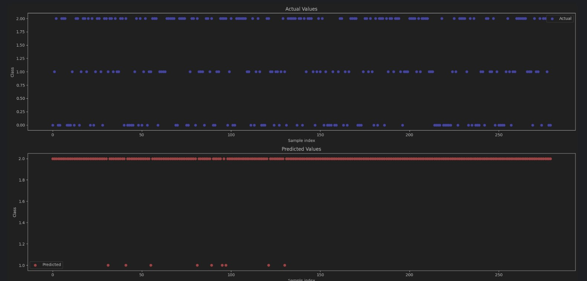
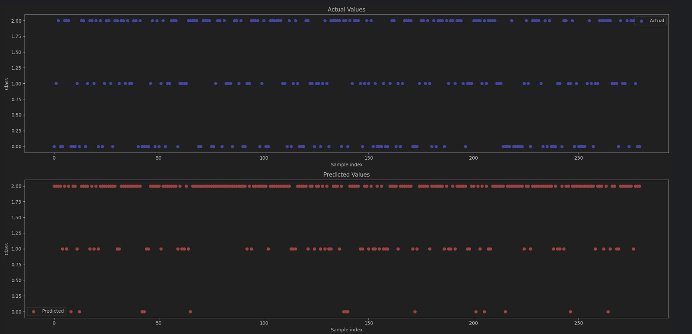

# ⚽ second_project (팀 프로젝트)

## OOF(Oracle of Football) 플랫폼 구축 프로젝트

### 📅 제작 기간
- 2024년 4월 18일 ~ 4월 25일
- 팀 프로젝트
- 7명

### 🎯 기획 목표
유럽 5대 축구 리그의 선수 및 경기 내용 데이터를 기반으로 구현한 기능 서비스를 통해 축구 스카우터, 게임 유저 및 팬들에게 경쟁력 있는 서비스 제공

### 👥 R&R
- 데이터 전처리
- 머신러닝/딥러닝 모델 학습 및 구현

### 🧰 사용언어 및 라이브러리
- **언어**: Python
- **개발 툴**: vscode
- **라이브러리**: [requirements.txt](requirements.txt)

## 🌟 서비스 기능
1. 신규 선수 속성에 대한 유망주 여부 예측
2. 신규 선수 속성에 대한 포지션별 유사 선수 분류 조회
3. 선수별 속성 비교 시각화
4. Langchain 기반 선수 정보 데이터 분석 Chatbot
5. 딥러닝(Softmax) 기반 승부 예측
6. Langchain 기반 경기 내용 조회 Chatbot
7. Langchain 기반 Foot-Ball RSS(Rich Site Summary) 요약봇

## 🎯 서비스 타겟
1. 축구팀 스카우터
2. 축구 게임(FIFA, FM, FC 등) 유저
3. 해외 및 국내 축구 팬

## 🗂 데이터 속성 정리

### 1. FM INSIDE
- **데이터 소개**: 전세계 축구 리그 및 팀 소속 스카우터들이 선수에 대한 포지션별 속성을 수치화한 데이터
- **데이터 출처**: [FM Inside](https://fminside.net)
- **수집 방법 및 건수**: 크롤링(Selenium, BeautifulSoup) / 25,862건
- **활용 방안**: LangChain 기반 선수 분석 Chatbot / 유망주 & 선수별 잠재력 예측 / 포지션별 유사 선수 클러스터링

### 2. FOTMOB
- **데이터 소개**: 23~4년도 유럽 5대 축구 리그별 경기 결과 & 출전 선수 라인업
- **데이터 출처**: [TransformMarkt](https://transfermarket.com)
- **수집 방법 및 건수**: 크롤링(Selenium, BeautifulSoup) / 12,913건
- **활용 방안**: Langchain 기반 경기 내용 조회 Chatbot / 팀, 포지션별 속성 수치 기반으로 승부 예측

### 3. TransferMarket
- **데이터 소개**: 24년도 유럽 5대 축구 리그 1~5부 선수별 Market Value
- **데이터 출처**: [FotMob](https://fotmob.com)
- **수집 방법 및 건수**: 크롤링(Selenium, BeautifulSoup) / 1,471건
- **활용 방안**: 포지션별 유사 선수 클러스터링 / 선수 Market Value 예측

## 📊 프로젝트 수행 내용

### 🧠 AI 모델링(1): ML / 유망주 & 선수별 능력치 및 잠재력 예측
- **활용 데이터**: FMInside 사이트의 Players 속성 Values
- **활용 용도**:
  1. 데이터에 의해 학습된 머신러닝 모델로 능력치 및 잠재력 예측 모델 구축
  2. 능력치에 의거한 유망한 선수 판별 가능
- **코드 링크**: [수비수_능력치 및 잠재력 예측.ipynb](능력치%20및%20잠재력%20예측/수비수_능력치,%20잠재력%20예측.ipynb)

### 🧠 AI 모델링(2): ML / 포지션별 유사 선수 분류 및 조회
- **활용 데이터**: FMInside 사이트의 Players 속성 Values
- **활용 용도**:
  1. 포지션별 주요 능력치를 KNN 모델에 학습
  2. 주요 능력치와 유사한 10명의 선수 분류, 조회
- **코드 링크**: [유사선수 분류 KNN.ipynb](KNN%20유사선수%20분류/Knn_DC%20(2).ipynb)

### 🧠 AI 모델링(3): ML / 선수 Market Value 예측
- **활용 데이터**: FMInside 사이트의 Players 속성 Values, Transform Market의 24년도 유럽 5대 축구 리그 1~5부 선수별 Market Value
- **활용 용도**: 포지션별 능력치, 잠재력 속성을 24년도 선수별 Market Vlaue와 맵핑해 선수별 Market Value 예측 모델 구축
- **코드 링크**: [수비수(DC)몸값 예측.ipynb](몸값%20예측/수비수(DC)몸값예측.ipynb)

### 🧠 AI 모델링(4): DL / 승부 예측
- **활용 데이터**: FMInside 사이트의 Players 속성 Values, FotMob 23~4년도 유럽 5대 축구 리그별 경기 결과 & 출전 선수 라인업
- **활용 용도**: 포지션별 평균 능력치와 23~4년도 경기 결과를 토대로 승부 예측 딥러닝 모델 학습
- **코드 링크**: [승부예측.ipynb](승부예측/승부예측.ipynb)

## 🛠️ 트러블 슈팅
1. **AI 모델링(1) 에서 유망주 & 선수별 능력치 및 잠재력 예측할 때 feature들을 10개로 맞추기로 했으나 어떤 feature가 능력치와 잠재력에 영향력을 미치는지 단언할 수 없었다.**
   - 처음에 상관관계 분석으로 상관관계가 높은 지표를 바탕으로 10개를 산출해서 모델 학습을 시켜봤으나 R2계수가 낮게 나와, 내가 생각하기에 포지션별로 가장 많은 영향을 끼칠것 같은 feature 10개를 골라서 R2계수가 가장 높은 feature들로 선택했다.

2. **AI 모델링(4) 에서 승부 예측을 하는데 예측값이 너무 '승' 쪽으로 편향되어있는 현상 발생**
    

      
편향된 승부 예측

      
    

    
    
    - 직접 딥러닝 모델의 Dense 레이어의 뉴런의 수를 바꿔가며 예측값이 가장 골고루 퍼지게 나오는 모델 선택
     
       

           
골고루 퍼진 승부 예측

           
       

    
## 🚀 중점 사항
- WBS 상시 확인: 과업별 진도 파악을 통한 기한 내 프로젝트 완성에 주력 [WBS](WBS%20및%20수행일지.xlsx)
- 코드 컨벤션 기반 코딩 주력: 생산성 향상 및 코드 인계간 빠른 의사결정으로 과업 진행 [코드컨벤션](데이터분석_코드컨벤션_0.1.pptx.pptx의%20사본)
- 데이터 EDA 및 리뷰 강조
- 기능별 구현을 위한 다양한 함수(머신러닝, 딥러닝 내장 함수) 적용 및 리뷰, 선정
- 주 사용자, 즉 고객 입장에서의 서비스/기능 정의 및 구현에 주력
- 기능 구현별 코드 최적화를 위한 상시 코드 디버깅 작업    

## 📝 미흡 사항 및 추후 과제
- 프로젝트 기간이 짧아 모델 튜닝할 시간이 부족
- 함수 정의 및 호출 기반의 코딩 습관 부족
- 라이브러리별 버전 충돌에 대한 상황 조치의 숙달 정도 부족
- 승부예측 모델에 대한 산포가 좀 더 골고루 퍼져 있는 모델 개발 필요

## 📂 산출물 
- 🎬 시연영상: [시연영상 링크](2차%20프로젝트(동영상).mp4)
- 📄 팀 포트폴리오: [팀 포트폴리오](OOF_Final_PJT.pdf)
- 🌐 스트림릿: [스트림릿 링크](https://sayoof-adios.streamlit.app/)

---

💬 **회고**: 이번 프로젝트에서는 머신러닝과 딥러닝을 적극 활용해보는걸 목표로 삼고 프로젝트에 임했다. 그러다 보니 오로지 모델이 예측하는 결과의 정확성에만 집중해서 내가 왜 이 모델을 학습시키는지에 대한 본질을 잊고 있었다.
항상 분석과 결과에 집중을 하다 보니 이런 이슈가 발생한 것이었다. 이로써 다음 프로젝트에는 사용자의 관점인 '서비스'에 좀 더 포커싱을 두기로 다짐했다.